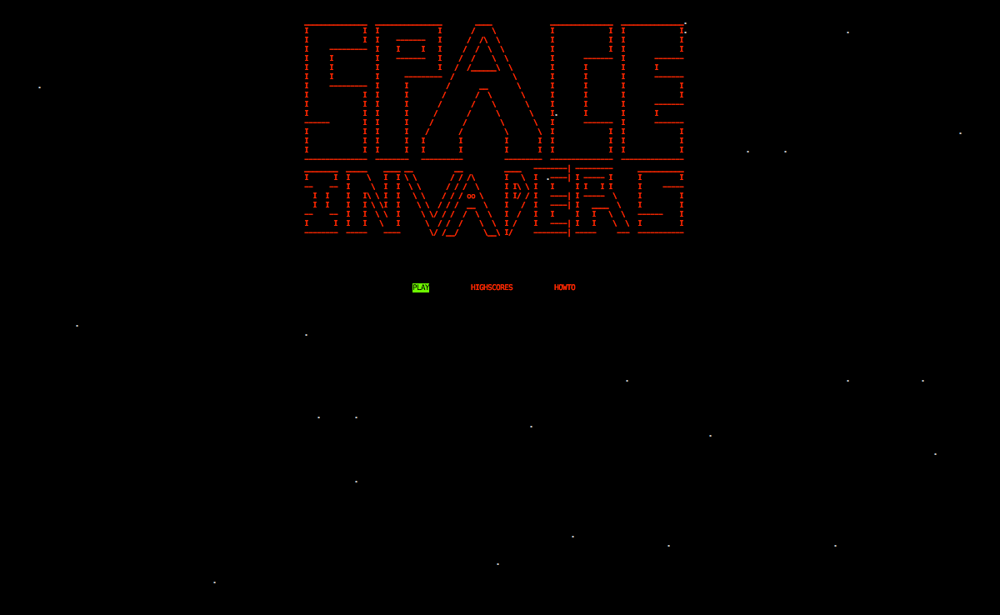
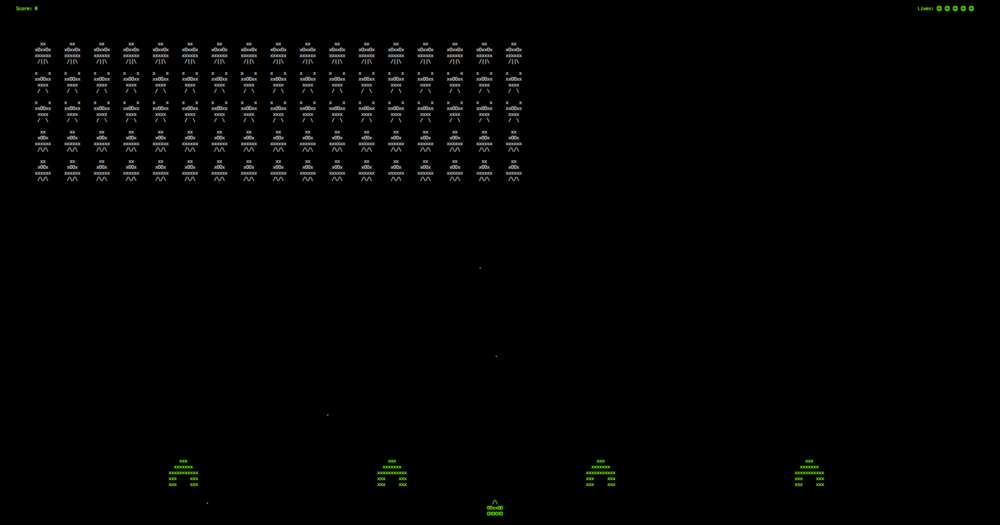

# Space Invaders
Terminal Space Invaders game written in Go.




#### Joystick bug

I've just found out that Ubuntu recognises my Microsoft keyboard as both a keyboard and a joystick,
meaning it creates `/dev/input/js0` despite the fact that there is no joystick connected.
The result is that the data read from this input can cause unwanted key press events in the game,
making it unplayable.

The quickfix is to simply `sudo rm /dev/input/js0`.

Alternatively you can establish a rule for `js0`.

#### Installation
```sh
go get -u github.com/asib/spaceinvaders
cd $GOPATH/src/github.com/asib/spaceinvaders
go build
```

You can also simply download a binary for your OS/Arch from [here](https://github.com/asib/spaceinvaders/releases).

#### Controls

* Use the arrow keys to move left/right, spacebar to fire.
* Press `q` at any time to quit.

The game will adjust the number of "invaders" to (roughly) fit your terminal's screen size.
This means you can make the game more/less difficult by making your screen bigger/smaller.
__Just make sure you don't resize the screen once you've started playing__, else the game will crash.

__If you're having trouble fitting all the graphics onto your terminal screen, even when it's maximised, lower your font size__.
